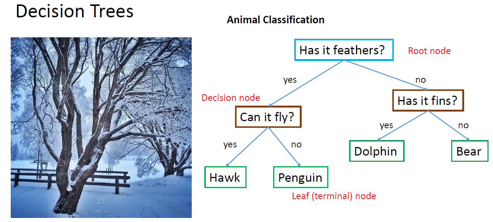
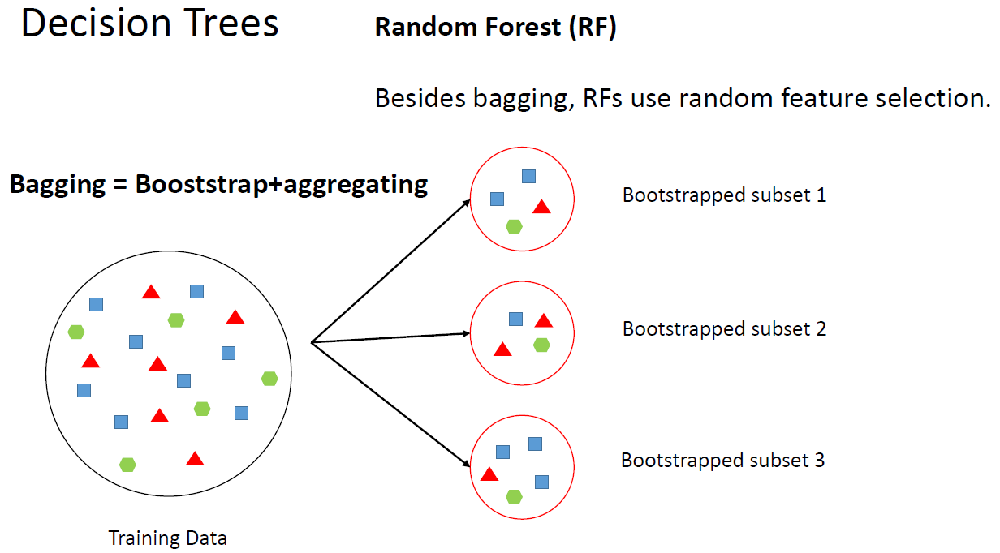
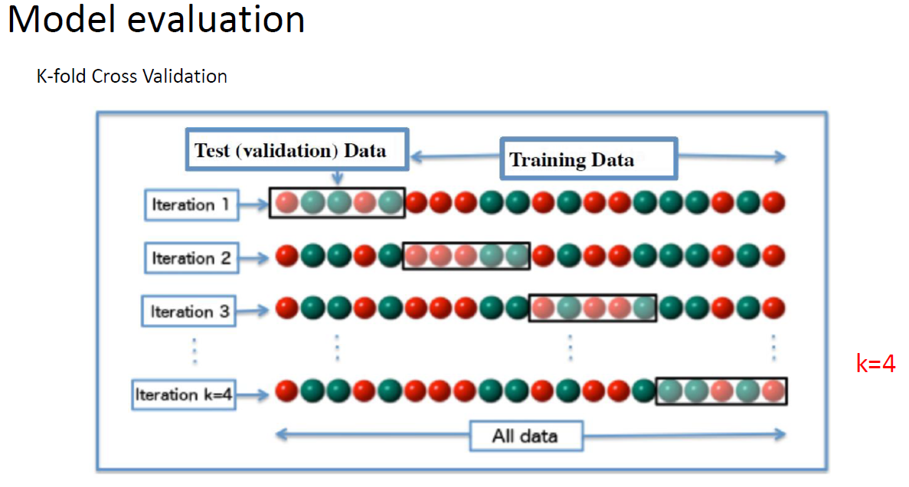

## Iris data set

We will use the *iris* database:

```{r}
x <- iris[which(iris[,5] != "setosa"), c(1,5)]
head(x)
```

## Serial mode

we will use the *foreach* function from the *doParallel* package to fit the data to a generalized linear model. 

```{r warning=FALSE, message=FALSE}
library(doParallel)
```

## Serial mode

Let's take a look at the performance of a logistic regression model in serial mode (1 core):

```{r}
trials <- 10000
stime <- system.time({
    r <- foreach(icount(trials), .combine=cbind) %do% {
        ind <- sample(100,100, replace=TRUE)
        result1 <- glm(x[ind,2]~x[ind,1], family=binomial(logit))
        coefficients(result1)
    }
})[3]
stime
```

## Parallel mode

Now, look at the performance using 2 cores:

```{r}
cl <- makeCluster(2)
registerDoParallel(cl)
ptime <- system.time({
    r <- foreach(icount(trials), .combine=cbind) %dopar% {
        ind <- sample(100,100, replace=TRUE)
        result1 <- glm(x[ind,2]~x[ind,1], family=binomial(logit))
        coefficients(result1)
    }
})[3]
ptime
stopCluster(cl)
```

What are the differences between the codes?

## Parallel mode

a graphical view of the scaling behavior can be seen in the following plot:

```{r echo=FALSE,warning=FALSE, message=FALSE}
library(tidyverse)

timing <- read.csv('timings.csv', header=TRUE, sep=",")

ggplot(data = timing, mapping = aes(x = Nr.cores, y = Time)) +
  geom_point() + geom_line() + labs(x="Nr. cores", y="Time (sec)")
```


## Is parallel processing always the best alternative?

```{r}
stime <- system.time(
        foreach(i=1:1e4) %do% sqrt(i) )
stime 

cl <- makeCluster(2)
registerDoParallel(cl)
ptime <- system.time( 
        foreach(i=1:1e4) %dopar% sqrt(i) )
ptime 
stopCluster(cl)
```

## Is parallel processing always the best alternative?

The message from this simple calculation is that one always needs to check the performance of the code vs. the number of requested cores.

## Machine Learning models

{width=800px}

## Machine Learning models

{width=800px}

## Machine Learning models

{width=800px}

## References
* https://swcarpentry.github.io/r-novice-inflammation/
* https://www.tutorialspoint.com/r/index.htm
* R High Performance Programming. Aloysius, Lim; William, Tjhi. Packt Publishing, 2015.
* https://www.r-bloggers.com/the-wonders-of-foreach/

[Return to Index](index.html)