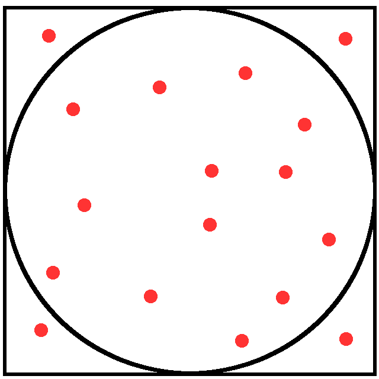

## Profiling 

* summary of the times spent in different function calls
* memory usage report

## Pi calculation

{width=100px}

$\textrm{Surface circle} = \left ( \frac{\textrm{Surface circle}}{\textrm{Surface square}} \right ) * (\textrm{Surface square})$  

is always valid. Knowing that $\textrm{Surface circle} = \pi * r^2$, $\pi$ can be computed as:

$\pi = \frac{1}{r^2} \left ( \frac{\textrm{Surface circle}}{\textrm{Surface square}} \right ) * (\textrm{Surface square})$

the ratio in parentheses is approximated with a Monte Carlo process throwing random points 

## Pi calculation

<div style="float: left; width: 50%;">
{width=250px}

+ The R function to compute Pi is:
</div>

<div style="float: right; width: 50%;">
```{r}
sim <- function(l) {
 c <- rep(0,l)
 hits <- 0
 pow2 <- function(x) {
   x2 <- sqrt( x[1]*x[1]+x[2]*x[2] )
   return(x2)
 }
 for(i in 1:l){
   x = runif(2,-1,1)
   if( pow2(x) <=1 ){
     hits <- hits + 1
   }
   dens <- hits/i
   pi_partial = dens*4
   c[i] = pi_partial
 }
 return(c)
}
```
</div>

## Pi calculation

The accuracy of the calculation increases with the number of iterations

```{r fig.width=5, fig.height=3, fig.align='center'}
size <- 100000
res <- sim(size)
plot(res[1:size],type='l', xlab="Nr. iterations", ylab="Pi")
lines(rep(pi,size)[1:size], col = 'red')
```


## Monitoring the execution time
### System.time

This function is included in R by default

```{r}
size <- 500000
system.time(
 res <- sim(size)
)
```

## Monitoring the execution time
### Tic toc

Another way to obtain execution times is by using the tictoc package:

```{r eval=FALSE}
install.packages("tictoc")
```

one can nest tic and toc calls and save the outputs to a log file:

## Monitoring the execution time
### Tic toc
```{r eval=TRUE}
library("tictoc")
size <- 1000000
sim2 <- function(l) {
   c <- rep(0,l)
   hits <- 0
   pow2 <- function(x) { x2 <- sqrt( x[1]*x[1]+x[2]*x[2] );  return(x2) }
   tic("only for-loop")
   for(i in 1:l){
      x = runif(2,-1,1)
      if( pow2(x) <=1 ){ hits <- hits + 1 }
      dens <- hits/i; pi_partial = dens*4; c[i] = pi_partial
   }
   toc(log = TRUE)
   return(c)
}
```

## Monitoring the execution time
### Tic toc
```{r eval=TRUE}
tic("Total execution time")
    res <- sim2(size)
toc(log = TRUE)
```

## Monitoring the execution time
### Tic toc
```{r eval=TRUE}
tic.log()
tic.clearlog()
``` 

## Rprof 
 
Rprof should be present in your R installation. For a graphical analysis, we will use *proftools* package. One needs to install this package in case it is not already installed. For R versions < 3.5 the instructions are:

```{r eval=FALSE}
install.packages("proftools")
source("http://bioconductor.org/biocLite.R")
biocLite(c("graph","Rgraphviz"))
```

while for R > 3.5 one needs to do

```{r eval=FALSE}
install.packages("proftools")
if (!requireNamespace("BiocManager", quietly = TRUE))
  install.packages("BiocManager")
BiocManager::install()
BiocManager::install(c("graph","Rgraphviz"))
```

## Rprof
the profiling is performed with the following lines:

```{r}
size <- 500000
Rprof("Rprof.out")
res <- sim(size)
Rprof(NULL)
``` 

## Rprof
the profiling is performed with the following lines:

```{r}
summaryRprof("Rprof.out") 
``` 

## Rprof
here you can see that the functions *runif* and *pow2* are the most expensive parts in our code. A graphical output can be obtained through the *proftools* package:

```{r eval=TRUE}
library(proftools)
p <- readProfileData(filename = "Rprof.out")
```

## Rprof

```{r eval=TRUE}
plotProfileCallGraph(p, style=google.style, score="total")
```

## Rbenchmark
 
One most probably needs to install this package as it is not included by default in R installations:
 
```{r eval=FALSE} 
install.packages("rbenchmark")
```
then we can benchmark our function *sim()*

```{r eval=TRUE}
library(rbenchmark)
size <- 500000
bench <- benchmark(sim(size), replications=10)
bench 
```

## Rbenchmark

```{r eval=TRUE}
bench 
```

the elapsed time is an average over the 10 replications we especified in the benchmark function. 

## Microbenchmark

If this package is not installed, do as usual:

```{r eval=FALSE}
install.packages("microbenchmark")
```

and do the benchmarking with:

```{r eval=TRUE}
library(microbenchmark)
bench2 <- microbenchmark(sim(size), times=10)
```

## Microbenchmark
```{r eval=TRUE}
bench2 
```

in this case we obtain more statistics of the benchmarking process like the *mean*, *min*, *max*, ... 


## References
* https://swcarpentry.github.io/r-novice-inflammation/
* https://www.tutorialspoint.com/r/index.htm
* R High Performance Programming. Aloysius, Lim; William, Tjhi. Packt Publishing, 2015.
* [Pi calculation](https://www.r-bloggers.com/estimation-of-the-number-pi-a-monte-carlo-simulation/)
